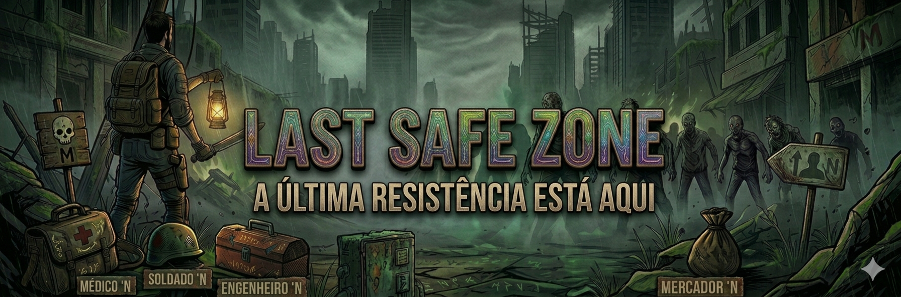

<h2>Esse é meu projeto da faculdade na qual foi desenvolvido um RPG Zumbi com uma API de IA no chat em java.<h2>

<h3>. O visual é em ASCII com java Swing e mapas pre-carregados dentro do jogo. 
. Futuramente sera adicionada mais funções como lojas e inventario para o jogador entre outras. 
. Você deve uar sua chave de api do gemini, no config.properties, podendo tambem alterar o modelo de IA no GeminiServices<h3>

